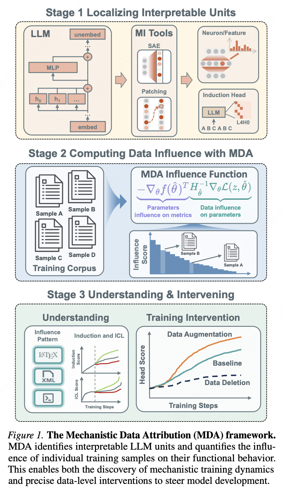

<div align="center">

# Mechanistic Data Attribution: <br>Tracing the Training Origins of Interpretable LLM Units

[](https://arxiv.org/abs/2601.21996)
[](https://opensource.org/licenses/MIT)
[](https://www.python.org)
<br>

**Jianhui Chen**<sup>1*</sup> &nbsp; **Yuzhang Luo**<sup>1*</sup> &nbsp; **Liangming Pan**<sup>12†</sup> 

<sup>1</sup>State Key Laboratory of Multimedia Information Processing, School of Computer Science, Peking University 
<br>
<sup>2</sup>Beijing Academy of Artificial Intelligence, Beijing, China
<br>
<sup>*</sup>Equal contribution. <sup>†</sup>Corresponding author.
<br>



</div>

<br/>

## 📖 Table of Contents

  - [🔥 Research Motivation](#-research-motivation)
  - [🏃 Environment Setup](#-environment-setup)
  - [📚 Dataset Download](#-dataset-download)
  - [⚙️ Configuration](#️-configuration)
  - [🚀 Quick Start](#-quick-start)
  - [📊 Output Format](#-output-format)
  - [🔍 Inspect Influential Samples](#-inspect-influential-samples)
  - [📝 Citation](#-citation)

## 🔥 Research Motivation

Understanding *how* Large Language Models (LLMs) develop their capabilities remains a fundamental challenge in AI alignment and development. While Mechanistic Interpretability has successfully reverse-engineered "interpretable units" (such as induction heads) inside trained models, most existing work relies on **post-hoc analysis**—revealing *what* is inside the model, but not *why* or *how* it emerged from the training pipeline.

We introduces **Mechanistic Data Attribution (MDA)** to bridge the critical gap between Mechanistic Interpretability and Data Attribution. Our framework is driven by four core motivations:

* **🔍 Tracing Causal Origins:** We aim to move beyond simply identifying neural circuits to uncovering their causal training origins. We seek to answer the question: *What specific training data "catalyzes" the formation of a particular attention head?*
* **🎯 Component-Specific Attribution:** Traditional Data Attribution methods (like standard Influence Functions) evaluate a training sample's impact on the model's *final output or overall loss*. MDA introduces a highly scalable framework to calculate influence scores at the granularity of **specific interpretable units** (e.g., a single attention head within a specific subspace).
* **🧬 Causal Evidence for LLM Capabilities:** By identifying and intervening on high-influence training data (e.g., removing or duplicating them), we provide direct causal evidence linking internal mechanisms to macroscopic capabilities. For instance, we demonstrate that manipulating the data responsible for induction heads directly and predictably impacts the model's In-Context Learning (ICL) performance.
* **🛠️ Proactive Model Development:** Ultimately, MDA shifts the paradigm from passive observation to active guidance. By discovering "catalyst data" for beneficial circuits, we enable **Mechanistic Data Augmentation**—allowing researchers to deliberately curate data mixtures that accelerate the convergence of desired model capabilities efficiently.

## 🏃 Environment Setup

To get started, follow these steps to set up your development environment and dataset. We recommend using `conda` for dependency management.

1.  **Create and Activate Conda Environment:**
    ```bash
    conda create -n mda python=3.10
    conda activate mda
    ```

2.  **Install Required Packages:**
    First, ensure your `pip` and `setuptools` are up to date. Then, install `torch` and the dependencies listed in `requirements.txt`.
    ```bash
    pip install -r requirements.txt
    ```

## 📚 Dataset Download

We use Pythia pretrained dataset, you can get the tokenized dataset following the instructions in [Exploring the Dataset](https://github.com/eleutherai/pythia?tab=readme-ov-file#exploring-the-dataset).

**Note:  We only use the first 2000 steps samples in the experiments.**


## ⚙️ Configuration

The project is driven by highly readable YAML configuration files. Here is an example of the configuration structure:

```yaml
# Dataset configuration
data:
  npy_path: "path/to/indicies.npy"
  num_train_samples: 819200
  seq_length: 2048
  batch_size_ekfac: 16
  batch_size_influence: 1
  num_workers: 2

# Target Head Configuration
target:
  layer: 5
  head: 10
  mode: "qkvo"          # Choose between: "qk" or "qkvo"

# Probe Settings
probe:
  type: "copy_target_synthetic"  # "copy_target_synthetic" | "copy_target_dataset" | "prev_attn"
  num_samples: 32
  induction_match: "current"
  match_choice: "last"

# Output Settings
output:
  dir: "path/to/output/dir"
  top_k: 1536
```

## 🚀 Quick Start

Ensure you have your environment set up with PyTorch and TransformerLens.

### Single GPU
Run the influence scoring pipeline on a single device:
```bash
python scripts/run_influence.py --config config/prev_attn.yaml
````

### Multi-GPU (Distributed)

Leverage `torchrun` for faster computation across multiple GPUs (e.g., 4 GPUs):

```bash
torchrun --nproc_per_node=4 scripts/run_influence.py --config config/copy_target.yaml
```

## 📊 Output Format

After successful execution, the script generates two NumPy arrays saved directly to your specified `output.dir`.

| File Name | Shape | Description |
| :--- | :---: | :--- |
| 📈 `top_pos.npy` | `[top_k, 3]` | **Most Positively Influential Samples.** <br>Contains `(score, index, loss)` for each sample. |
| 📉 `top_neg.npy` | `[top_k, 3]` | **Most Negatively Influential Samples.** <br>Contains `(score, index, loss)` for each sample. |

## 🔍 Inspect Influential Samples

Your can inspect the most influential samples with the following script. 

```python
python utils/bath_view_influence.py \
    --result-json path/to/top_pos.npy \
    --data-npy path/to/indicies.npy \
    --tokenizer path/to/checkpoint \
    --output-json path/to/output \
    --topk 200 
```


## 📝 Citation

If you find our work or this code useful in your research, please consider citing:

```
@article{chen2026mechanistic,
  title={Mechanistic data attribution: Tracing the training origins of interpretable llm units},
  author={Chen, Jianhui and Luo, Yuzhang and Pan, Liangming},
  journal={arXiv preprint arXiv:2601.21996},
  year={2026}
}
```

